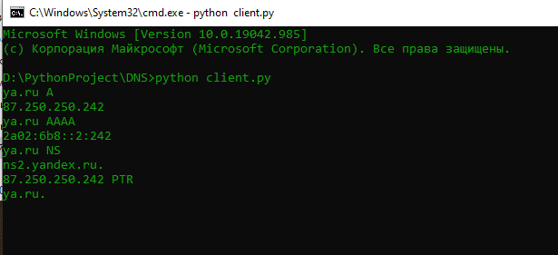
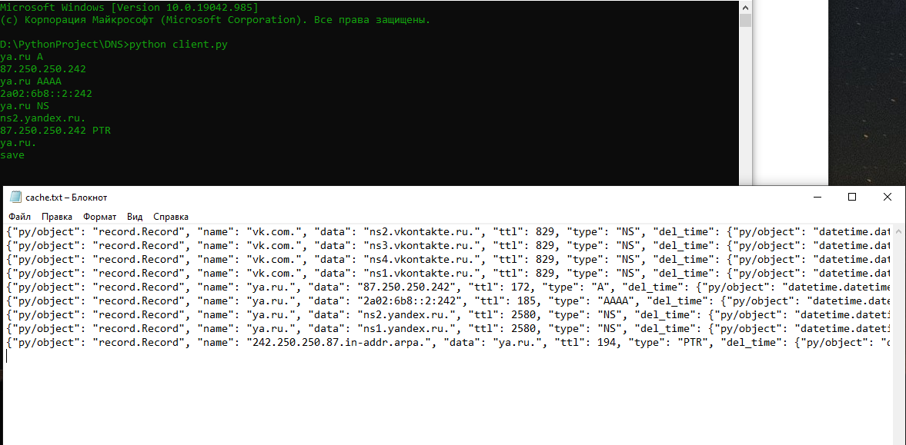

# DNS
Запуск сервера выполняется командой `python server.py`  
Для удобства работы я написал простого клиента  `python client.py`  
Работа с клиентом выстроена так  
<pre>
< hostName > < recordType > - выполнение рекурсивного запроса
< save > - для сохранения кеша сервера  
</pre>
Например для записи _A_ и имени _vk.com_ необходимо `vk.com A`  
Пример работы  
  

Как видим файл кеша обновился

  
